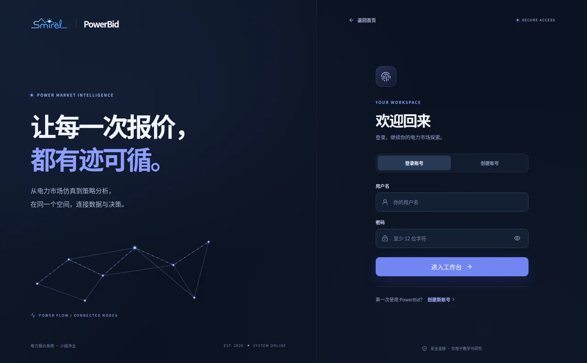
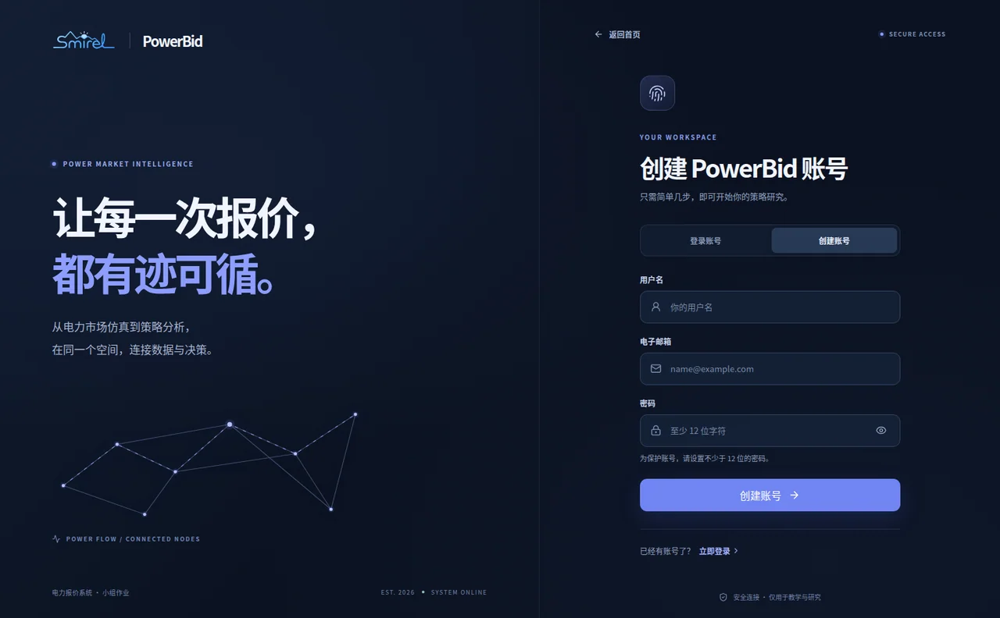
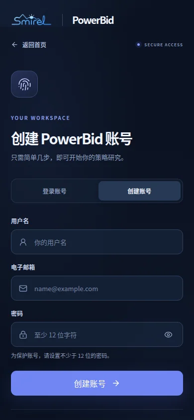
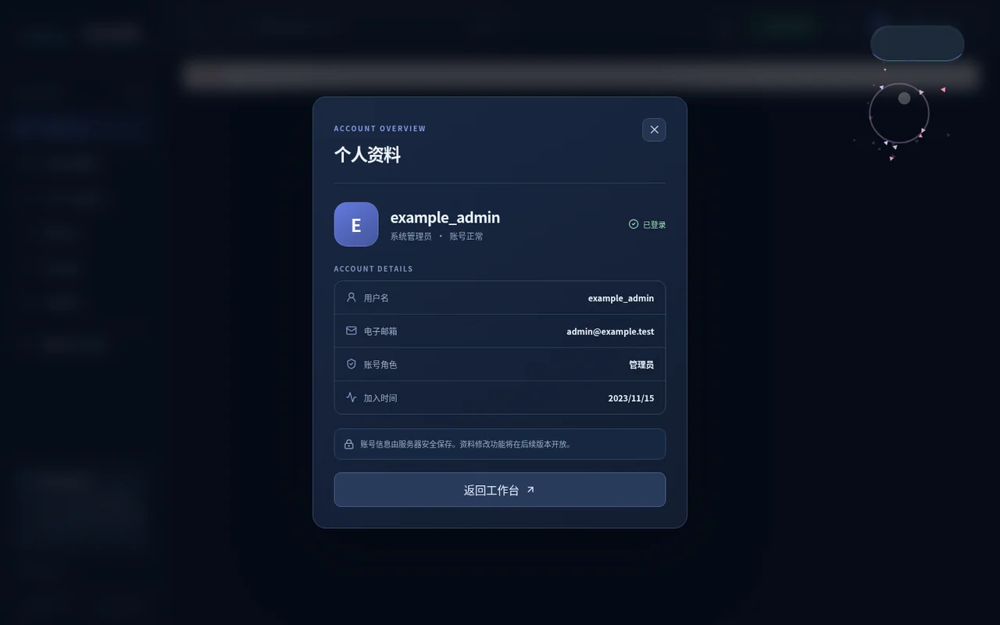
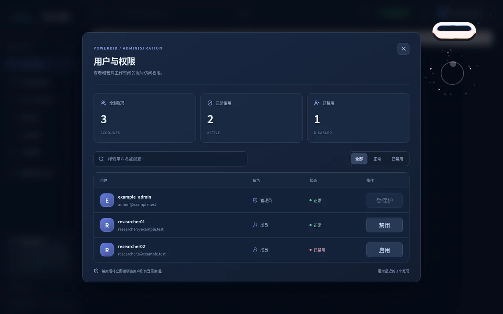
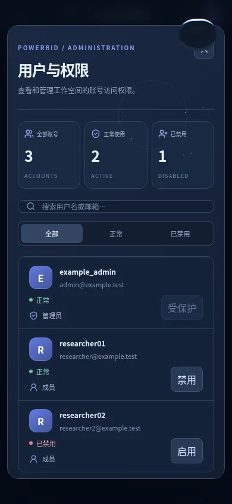

# PowerBid 账号界面设计预览

本页用于 UI 审查，示例账号均为虚构数据。账号功能仍保持独立开发分支，未启用线上注册/登录拦截。

## 登录页

## 注册页

## 个人资料

## 管理员中心

已实现的交互：登录/注册双向切换、密码显示/隐藏、验证错误反馈、个人资料面板、账号菜单、管理员搜索/状态筛选、启用/禁用二次确认。手机顶部和桌面顶部均能访问账户菜单。

注意：个人资料目前只有服务器记录的用户名、邮箱、角色和加入时间；资料编辑、重置密码、邮箱验证在下一阶段实现，当前界面没有无效的假编辑按钮。

启用前必须先按 [账号系统说明](ACCOUNT_SYSTEM.md) 初始化持久化数据及管理员，不要将演示账号资料混入正式数据库。
